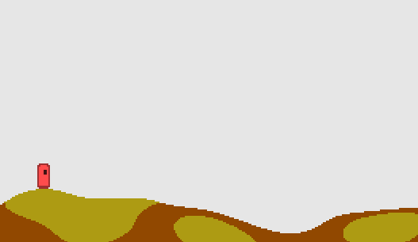

# Mato
A competitive deathmatch game inspired by [Liero](https://www.liero.be/) and [Noita](https://noitagame.com/)

## What is this?
This is an in-development game that uses the [DragonRuby Game Toolkit](https://dragonruby.herokuapp.com/toolkit/game).

Note: This game uses C Extensions, which require a Pro license to DragonRuby for development.  
The released binaries are completely self contained, and do not require any licenses to play.

Planned features include:
 - Deathmatch gameplay (inspired by Liero)
 - Fully destructable, simulated terrain  (inspired by Noita)
 - LAN multiplayer
